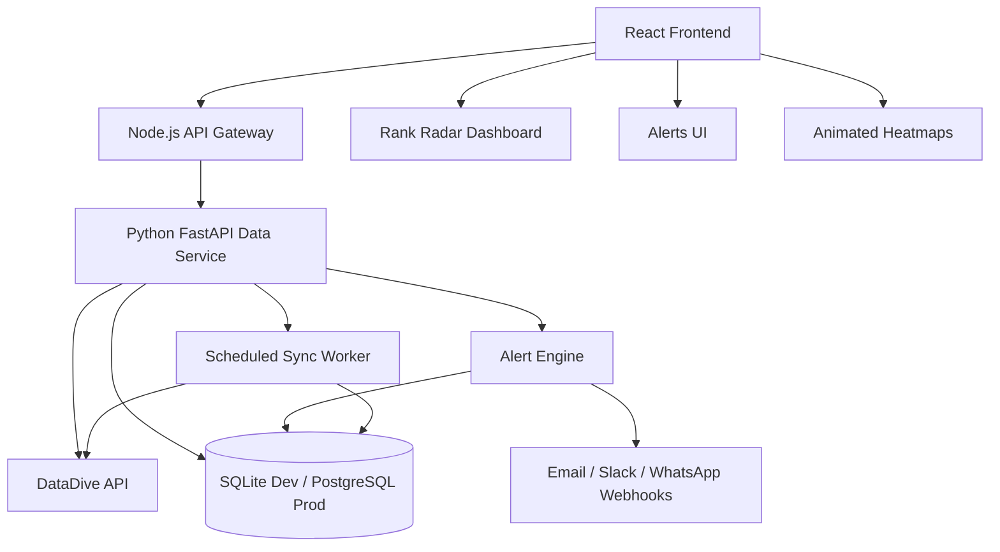

# RankRadar OS

A production-style Rank Radar monitoring layer for DataDive, built with a React frontend, Node.js API gateway, and Python data service.

This app is designed as a focused command center for Amazon SEO rank monitoring. It shows only the Rank Radar data that matters: brands, marketplaces, products, ASINs, SKUs, variations, keywords, daily ranks, rank movement, PPC context, summaries, heatmaps, and alerts.

## What It Solves

RankRadar OS improves on a basic rank table by adding:

- Brand + marketplace filtering.
- Product overview with ASIN, parent ASIN, SKU, tracked keyword count, variation count, and alert health.
- Keyword-level rank monitoring.
- Child-ASIN / variation winner and loser view.
- Daily rank volatility heatmap.
- Organic rank + sponsored rank + PPC spend overlay chart.
- Configurable DataDive API adapter.
- Alert engine for rank drops, top-10 loss, page-one loss, unranking, and recoveries.
- Acknowledge/resolve alert actions.
- Mock mode for development without a DataDive key.
- Server-side-only API key handling.

## Tech Stack

| Layer | Technology | Responsibility |
|---|---|---|
| Frontend | React + Vite + Framer Motion + Recharts | Beautiful responsive dashboard, animated heatmaps, charts, product/keyword UI |
| API Gateway | Node.js native HTTP server | Browser-facing API, CORS, rate limiting, request routing, error shaping |
| Data Service | Python + FastAPI | DataDive integration, ingestion, normalization, rank summaries, alerts, sync jobs |
| Dev DB | SQLite | Zero-friction local development |
| Prod DB | PostgreSQL schema included | Structured production storage |

## Folder Structure

```txt
rankradar-os/
  apps/
    web/                         React frontend dashboard
      src/
        components/              Reusable dashboard components
        pages/                   Settings/admin pages
        App.jsx                  Main RankRadar OS app shell
        api.js                   Browser API client
        styles.css               Full responsive dashboard styling
    api/                         Node.js API gateway
      src/
        server.js                HTTP server + CORS + rate limiting
        router.js                API route mapping to Python service
        proxy.js                 Internal Python service fetch wrapper
        errors.js                Standard JSON error responses
      tests/                     Node API tests
  services/
    rankradar-worker/            Python DataDive ingestion and analytics service
      app/
        main.py                  FastAPI application and endpoints
        datadive_client.py       Mock/live DataDive provider adapters
        store.py                 SQLite repository + demo seed + query layer
        alerts.py                Alert detection logic
        summaries.py             Summary/heatmap calculations
        sync.py                  Sync orchestration
        demo_data.py             Deterministic mock Rank Radar dataset
      tests/                     Python unit tests
  database/
    migrations/                  PostgreSQL schema migration
  docs/
    architecture.md              Architecture and data flow notes
  packages/
    shared/                      Shared contracts/constants placeholder
  .env.example                   Required environment variables
  docker-compose.yml             Optional PostgreSQL + Redis services
  README.md
```

## Architecture Diagram



## Data Flow

1. User opens the React dashboard.
2. React calls the Node API gateway.
3. Node forwards safe internal requests to the Python service.
4. Python reads from the local normalized rank store.
5. Python syncs from DataDive through a provider adapter.
6. The alert engine flags drops, losses, unranked keywords, and recoveries.
7. React displays product cards, summaries, heatmaps, keyword tables, charts, and alerts.

## Environment Variables

Copy `.env.example` to `.env` and fill the values.

```env
DATADIVE_PROVIDER=mock
DATADIVE_API_KEY=
DATADIVE_API_BASE_URL=
DATADIVE_ORG_ID=
PYTHON_SERVICE_URL=http://localhost:8001
VITE_API_BASE_URL=http://localhost:4000
```

### Mock Mode

```env
DATADIVE_PROVIDER=mock
```

Mock mode works immediately and seeds realistic rank history.

### Live DataDive Mode

```env
DATADIVE_PROVIDER=live
DATADIVE_API_KEY=your_server_side_key
DATADIVE_API_BASE_URL=https://your-datadive-api-base-url
DATADIVE_ORG_ID=your_org_id
```

Exact DataDive endpoint paths can be configured without changing code:

```env
DATADIVE_ENDPOINT_BRANDS=/brands
DATADIVE_ENDPOINT_MARKETPLACES=/marketplaces
DATADIVE_ENDPOINT_PRODUCTS=/rank-radar/products
DATADIVE_ENDPOINT_PRODUCT_RANKS=/rank-radar/products/{product_id}
DATADIVE_ENDPOINT_VARIATION_RANKS=/rank-radar/products/{product_id}/keywords/{keyword_id}/variations
```

The API key is never exposed to React.

## Local Setup

### 1. Start Python Data Service

```bash
cd services/rankradar-worker
python -m venv .venv
source .venv/bin/activate   # Windows: .venv\Scripts\activate
pip install -r requirements.txt
uvicorn app.main:app --reload --port 8001
```

Visit:

```txt
http://localhost:8001/health
```

### 2. Start Node API Gateway

```bash
cd apps/api
npm install
npm run dev
```

Visit:

```txt
http://localhost:4000/api/health
```

### 3. Start React Frontend

```bash
cd apps/web
npm install
npm run dev
```

Visit:

```txt
http://localhost:5173
```

## Root-Level Commands

After installing dependencies in each workspace:

```bash
npm run dev
npm run test
npm run check
```

## Database

Local development uses SQLite automatically at:

```txt
services/rankradar-worker/data/rankradar.sqlite3
```

A PostgreSQL production schema is included at:

```txt
database/migrations/001_rankradar_init.sql
```

Optional local PostgreSQL/Redis:

```bash
docker compose up -d
```

## API Endpoints

### Health and Settings

```http
GET /api/health
GET /api/datadive/status
POST /api/datadive/test-connection
```

### Filters

```http
GET /api/rank-radar/brands
GET /api/rank-radar/marketplaces?brandId=
```

### Product Overview

```http
GET /api/rank-radar/products?brandId=&marketplace=&status=
```

### Product Detail

```http
GET /api/rank-radar/products/:productId
GET /api/rank-radar/products/:productId/summary
GET /api/rank-radar/products/:productId/keywords?q=&status=&movement=
GET /api/rank-radar/products/:productId/keywords/:keywordId/trend
GET /api/rank-radar/products/:productId/keywords/:keywordId/variations
```

### Alerts

```http
GET /api/rank-radar/alerts?brandId=&marketplace=&productId=&severity=&status=
POST /api/rank-radar/alerts/:alertId/acknowledge
POST /api/rank-radar/alerts/:alertId/resolve
GET /api/rank-radar/alert-rules
POST /api/rank-radar/alert-rules
PATCH /api/rank-radar/alert-rules/:ruleId
```

### Sync

```http
POST /api/rank-radar/sync
GET /api/rank-radar/sync-runs
```

## Alert Rules

Default alert logic:

| Rule | Meaning | Severity |
|---|---|---|
| `CRITICAL_DROP` | Rank worsens by 10+ positions | Critical |
| `MAJOR_DROP` | Rank worsens by 5+ positions | High |
| `LOST_PAGE_1` | Rank moves from 1-16 to 17+ | Critical |
| `LOST_TOP_10` | Rank moves from 1-10 to 11+ | High |
| `NEW_UNRANKED` | Ranked keyword becomes unranked/missing | Critical |
| `RECOVERY` | Rank improves by 5+ positions | Positive |

Important: Amazon rank numbers get worse as they increase. Rank `1` is best.

## Testing

### Python

```bash
cd services/rankradar-worker
python -m unittest discover -s tests
```

Covers:

- Alert detection.
- Summary calculations.
- Heatmap aggregation.
- Mock DataDive client.

### Node API

```bash
cd apps/api
npm test
```

Covers:

- Health route proxying.
- Missing route errors.
- CORS preflight handling.

### React

```bash
cd apps/web
npm test
```

Includes starter component smoke tests. Add more tests as the UI grows.

## DataDive Integration Notes

The live DataDive API adapter is intentionally configurable because API endpoint paths can differ by account/API version.

The adapter lives here:

```txt
services/rankradar-worker/app/datadive_client.py
```

To connect real DataDive data:

1. Set `DATADIVE_PROVIDER=live`.
2. Add `DATADIVE_API_KEY` and `DATADIVE_API_BASE_URL`.
3. Adjust `DATADIVE_ENDPOINT_*` paths if required.
4. Run `POST /api/datadive/test-connection`.
5. Run `POST /api/rank-radar/sync`.
6. Map/normalize any account-specific fields into the `rank_records` schema.

## Deployment Notes

Recommended production deployment:

- React frontend: Vercel, Netlify, Cloudflare Pages, or static Nginx.
- Node API gateway: Render, Railway, Fly.io, ECS, or VPS.
- Python data service: Render, Railway, Fly.io, ECS, or VPS.
- Database: PostgreSQL.
- Queue/cache: Redis if scheduled sync volume increases.

Keep these services private where possible:

- Python data service should not be publicly reachable unless protected.
- DataDive API key should only exist in the Python service environment.
- Node API should be the only browser-facing backend.

## Troubleshooting

### Frontend shows API error

Confirm Node API is running:

```bash
curl http://localhost:4000/api/health
```

### Node API cannot connect to Python

Confirm Python is running:

```bash
curl http://localhost:8001/health
```

Check:

```env
PYTHON_SERVICE_URL=http://localhost:8001
```

### DataDive test connection fails

Check:

- `DATADIVE_PROVIDER=live`
- `DATADIVE_API_KEY`
- `DATADIVE_API_BASE_URL`
- endpoint paths
- account/API permissions

### No products visible

Use mock mode first:

```env
DATADIVE_PROVIDER=mock
```

Then run:

```bash
curl -X POST http://localhost:4000/api/rank-radar/sync
```

## Known Limitations

- Real DataDive endpoint paths are configurable but not hardcoded because the exact API contract was not included in the project brief.
- The local store is SQLite for immediate demo usage. PostgreSQL schema is included for production.
- Notification webhooks are represented in env/config and alert structure; actual Slack/email/WhatsApp delivery should be wired once credentials are available.
## Render Deployment

Use one Render Web Service.

Form values:

- Name: `rankradar-os`
- Language: `Python 3`
- Branch: `main`
- Root Directory: `services/rankradar-worker`
- Build Command: `pip install -r requirements.txt && cd ../../apps/web && npm install && npm run build`
- Start Command: `uvicorn app.main:app --host 0.0.0.0 --port $PORT`
- Instance Type: `Free`
- Health Check Path: `/health`

Environment variables:

- `RANKRADAR_ENV=production`
- `DATADIVE_PROVIDER=live`
- `DATADIVE_API_BASE_URL=https://api.datadive.tools`
- `DATADIVE_API_KEY=<your DataDive key>`
- `MONGODB_URI=<your MongoDB Atlas URI>`
- `MONGODB_DB=rankradar-os`

The single Python service serves both the React dashboard and the `/api/...` endpoints. No separate Node or static Render service is required.
