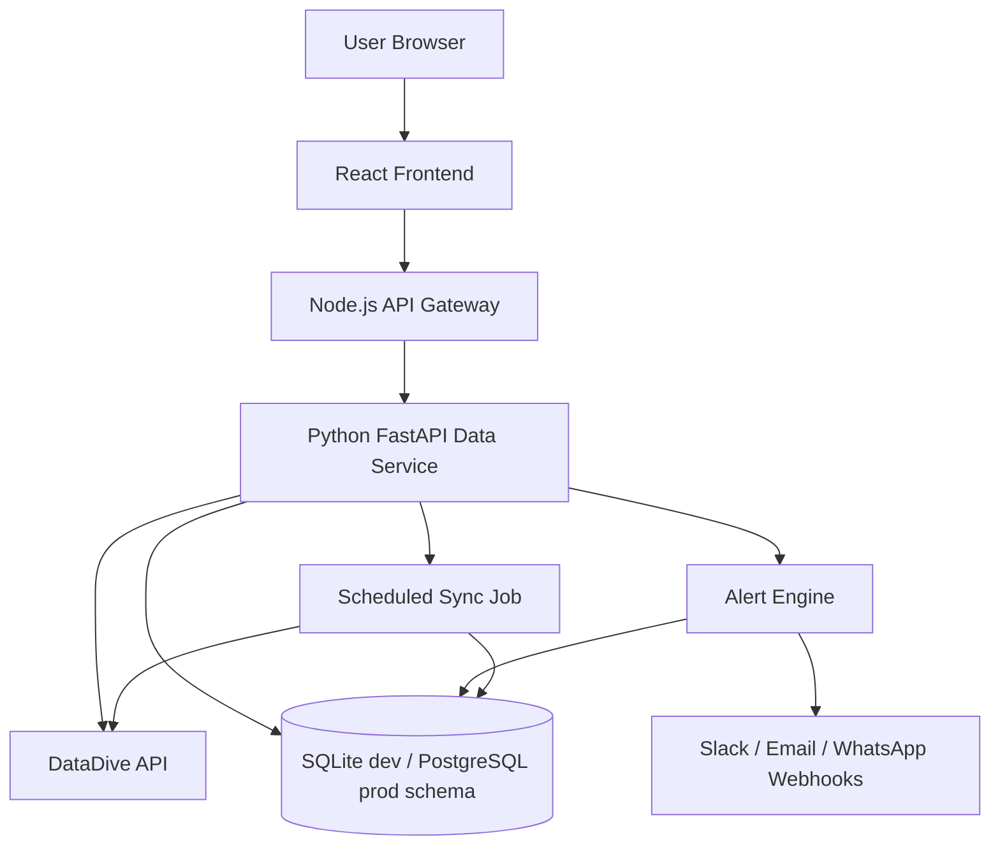

# Architecture Notes

RankRadar OS is split into three runtime surfaces:

1. React dashboard in `apps/web`.
2. Node.js API gateway in `apps/api`.
3. Python data service in `services/rankradar-worker`.

The Node API is intentionally thin. It keeps browser traffic away from the Python service, applies CORS/rate limiting, shapes errors, and prevents DataDive credentials from ever reaching the frontend.

The Python service owns DataDive ingestion, normalization, historical rank calculations, heatmap/summary data, alert detection, and sync run logging.

## Why this split works

- React stays fast and focused on visualization.
- Node can be swapped into any existing JS app without exposing secrets.
- Python is better suited for data ingestion, normalization, calculations, and scheduled processing.
- The DataDive integration is adapter-based, so exact account-specific API paths can be configured through environment variables.

## Data normalization contract

Every raw DataDive rank payload should eventually become a `rank_records` row with:

- product ID
- variation/child ASIN ID when present
- keyword ID
- marketplace ID
- rank date
- organic rank
- previous organic rank
- rank change
- sponsored/PPC metrics when available
- raw payload for auditability

## Alert model

Alerts are deterministic and repeatable. The current default rules are:

- `CRITICAL_DROP`: rank worsens by 10+ positions.
- `MAJOR_DROP`: rank worsens by 5+ positions.
- `LOST_PAGE_1`: rank moves from 1-16 to 17+.
- `LOST_TOP_10`: rank moves from 1-10 to 11+.
- `NEW_UNRANKED`: ranked keyword disappears.
- `RECOVERY`: rank improves by 5+ positions.
